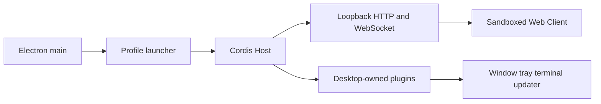

# From Harness to Desktop: Find the Carrier Before Building the Shell

[中文](0001-harness-to-desktop.md)

Lesson 0001, approximately 20 minutes.

The goal is not to memorize DSH filenames. It is to determine what a new
Harness already provides and what the desktop layer must add.

## One core conclusion

Fast desktop integration comes from boundary reuse, not from Electron itself.
When the Host, Web carrier, Client, and data semantics already exist, the
desktop layer owns startup, lifecycle, native windows, and packaging. A TUI or
private protocol without an embeddable Client does not become a complete
desktop product merely by adding a shell.

## The five-layer model

| Layer | Responsibility |
| --- | --- |
| Host | Agent, model, tool, session, and plugin runtime |
| Carrier | HTTP, WebSocket, RPC, or process protocol between Host and UI |
| Client | Official Web UI, third-party UI modules, and extension points |
| Profile | Configuration, plugin composition, data roots, and selection |
| Native | Window, tray, single instance, terminal, updater, and installer |

Fill these five layers with evidence before choosing Electron, Tauri, or a
sidecar. The framework is a later decision.

## How DSH performs the integration

1. Electron main acquires the single-instance lock and selects a profile.
2. The launcher boots the official Cordis Host and registers Desktop services
   before third-party Loader entries.
3. Official `dsh-base` and `dsh-web-app` bundles provide loopback HTTP and
   WebSocket transport.
4. BrowserWindow loads the same-origin Web surface; the renderer remains
   sandboxed without raw Electron APIs.
5. Desktop-owned plugins manage windows, tray, profiles, pnpm, terminal, and
   updates.
6. Electron, Node helpers, pnpm, and native modules form a verifiable runtime
   closure.

Primary evidence is in the [DSH Desktop architecture](../../architecture.en.md),
the [package README](../../../dsh-plugin-desktop/README.md), and the
[Desktop service contract](../../../dsh-plugin-desktop/docs/plugin-services.md).

## Four integration patterns

| Target shape | Preferred pattern | Desktop responsibility |
| --- | --- | --- |
| Composable Host and local Web UI | Thin host | Start Host, await health, load loopback UI, manage exit |
| CLI starts a local server | Sidecar | Own process tree, port, logs, health, and recovery |
| Static SPA and remote API | Static Client | Package assets; handle auth, CORS, updates, availability |
| TUI or private protocol only | Client/transport prerequisite | Design a stable boundary before estimating desktop work |

## Why compatibility comes first

Compatibility presentation proves the critical product loop: the official
runtime, UI, user data, and plugins preserve their semantics inside the desktop
environment. Advanced layouts and native materials begin only after that loop
passes.

Copying upstream pages, inventing a second IPC plugin protocol, migrating the
session database, or exposing BrowserWindow to third parties expands the
maintenance surface before the carrier has been proven.

## Scenario practice

### Scenario A

Qianwen Harness publishes `qwen web --port 0`, prints a loopback URL, and keeps
official plugins and sessions in that process. Choose a thin host. Prove Host
startup, health discovery, sandboxed loading, and complete process-tree
teardown before rewriting any UI.

### Scenario B

An XX Web UI is a static SPA backed only by a cloud API. Do not copy DSH's
profile launcher. Use the static-Client pattern and focus on authentication,
remote APIs, offline states, content security, and updates.

### Scenario C

A Harness exposes only an interactive TUI and undocumented stdout text. Do not
promise a two-day desktop port. First establish a stable non-interactive entry,
structured transport, and state model.

## Completion criteria

- Recall the five layers without looking.
- Explain why DSH Desktop reuses the loopback carrier instead of creating a
  renderer IPC plugin system.
- Select one of the four patterns for a candidate and identify missing evidence.

Next, use the [Harness Desktop Adapter quick reference](../reference/harness-desktop-adapter.en.md)
for a 30-minute discovery. The reference Skill is
[`harness-desktop-adapter/SKILL.md`](../skills/harness-desktop-adapter/SKILL.md).
