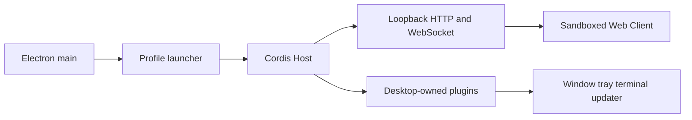

# 从 Harness 到 Desktop：先找载体，再写壳

[English](0001-harness-to-desktop.en.md)

Lesson 0001，预计 20 分钟。

本课的目标不是记住 DSH 的文件名，而是学会判断：一个新 Harness 已经提供了哪些可复用能力，桌面层只需要补哪一小块。

## 一个核心结论

快速桌面化的来源不是 Electron 本身，而是复用边界。如果 Host、Web carrier、Client 和数据语义已经存在，桌面层只负责启动、生命周期、原生窗口和打包。反过来，如果目标只有 TUI 或内部协议，没有可嵌入 Client，套壳并不会自动得到完整桌面产品。

## 五层模型

| 层 | 责任 |
| --- | --- |
| Host | Agent、模型、工具、会话和插件运行时 |
| Carrier | Host 与界面之间的 HTTP、WebSocket、RPC 或进程协议 |
| Client | 官方 Web UI、第三方界面模块和 UI 扩展点 |
| Profile | 配置、插件组合、数据根目录和用户选择 |
| Native | 窗口、托盘、单实例、终端、更新和安装器 |

面对 Qianwen Harness 或任何新 Web UI，先把事实填入这五层。只有证据充分后，才选择 Electron、Tauri 或 sidecar。技术框架是后置决策。

## DSH 是怎样完成接入的

1. Electron main 获取单实例锁并选择 profile。
2. Launcher 启动官方 Cordis Host，在第三方 Loader entry 之前注册 Desktop service。
3. 官方 `dsh-base` 与 `dsh-web-app` 提供 loopback HTTP/WebSocket。
4. BrowserWindow 加载同源 Web 页面；Renderer 保持 sandbox，不获得原始 Electron API。
5. 窗口、托盘、profile、pnpm、终端和更新由 Desktop-owned plugins 管理。
6. Electron、Node helper、pnpm 和 native modules 组成可验证的运行时闭包。

一手证据见 [DSH Desktop 架构](../../architecture.md)、[package README](../../../dsh-plugin-desktop/README.md) 和 [Desktop service contract](../../../dsh-plugin-desktop/docs/plugin-services.md)。

## 新目标的四种接入模式

| 目标形态 | 优先模式 | 桌面层主要工作 |
| --- | --- | --- |
| 可组合 Host 与本地 Web UI | 薄宿主 | 启动 Host、等待健康、加载 loopback 页面、管理退出 |
| CLI 可启动本地 Server | Sidecar | 管理进程树、端口、日志、健康检查和崩溃恢复 |
| 纯静态 SPA 与远程 API | 静态 Client | 打包静态资源，处理认证、CORS、更新和远程服务可用性 |
| 只有 TUI 或私有协议 | 先补公共 Client/transport | 先设计稳定边界，再估算桌面工作 |

## 兼容模式为什么必须先做

兼容模式验证最重要的产品闭环：官方运行时、官方 UI、用户数据和插件能否在桌面环境中保持原语义。高级布局、Mica、原生拖动区和自定义导航都应该在这个闭环通过后再加入。

原型早期如果开始复制上游页面、发明新的 IPC 插件协议、迁移会话数据库，或者让第三方插件直接拿到 BrowserWindow，说明维护面正在扩大，但基本载体还没有得到证明。

## 场景练习

### 场景 A

Qianwen Harness 发布了 `qwen web --port 0`，启动后输出 loopback URL；官方插件和会话都由同一进程管理。你先选什么模式？

**判断：** 选择薄宿主。先证明桌面进程能启动官方 Host、捕获健康 URL、用 sandboxed window 加载页面，并在退出时回收完整进程树。不要先重写 UI。

### 场景 B

某个 XX Web UI 是静态 SPA，只调用云端 API，没有本地 Host，也没有插件或 profile。你应该复制 DSH 的 profile launcher 吗？

**判断：** 不应该。这是静态 Client 模式。重点转为认证、远程 API、离线状态、内容安全策略和更新；profile launcher 没有对应的领域责任。

### 场景 C

一个 Harness 只有交互式 TUI，内部状态通过未文档化的 stdin/stdout 文本交换。能否直接承诺“两天完成 Desktop”？

**判断：** 不能先承诺。先验证是否存在稳定的非交互入口、结构化 transport 和状态模型。如果没有，主要工作是产品/API 设计，而不是桌面包装。

## 本课完成标准

- 能不看答案说出五层模型。
- 能解释为什么 DSH Desktop 复用 loopback carrier，而不是新建 Renderer IPC 插件系统。
- 能为一个候选项目选择四种接入模式之一，并指出还缺少的证据。

下一步使用 [Harness Desktop Adapter 速查表](../reference/harness-desktop-adapter.md) 对真实候选项目做一次 30 分钟 discovery。参考 Skill 位于 [`harness-desktop-adapter/SKILL.md`](../skills/harness-desktop-adapter/SKILL.md)。
