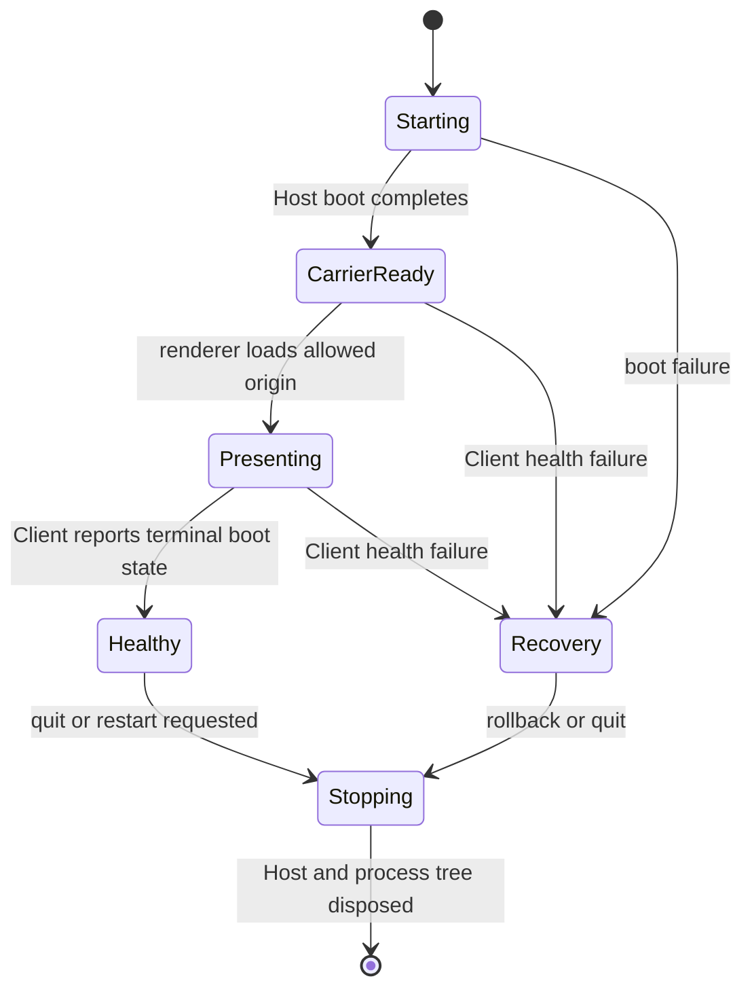

# From Evidence Map to Compatibility Tracer

[中文](0002-evidence-map-to-compatibility-tracer.md)

Lesson 0002, approximately 25 minutes.

This lesson trains one capability: turn discovery facts into a compatibility
tracer that can be verified automatically. A tracer is the smallest end-to-end
path through Host startup, Carrier readiness, Client presentation, and complete
shutdown.

## Before starting: retrieve from memory

Without opening Lesson 0001, write the five layers of Harness Desktop
integration. Then answer: which layer decides when the UI may load?

Check against [Lesson 0001](0001-harness-to-desktop.en.md) afterward. The layers
are Host, Carrier, Client, Profile, and Native. The Client cannot decide alone;
the Carrier must expose a verifiable health signal first.

## Separate facts, unknowns, and decisions

The most common discovery mistake is promoting one successful run into a stable
contract.

| Type | Example | Ready for implementation? |
| --- | --- | --- |
| Fact | CLI help declares `--port 0`; a test confirms the actual port | Yes, with evidence location |
| Unknown | Whether grandchildren survive direct-parent exit | No, design an experiment |
| Decision | Desktop accepts only a `127.0.0.1` carrier | Yes, with rationale and verification |
| Assumption | A URL on stdout means every plugin has loaded | No, convert to fact or unknown |

An evidence map prevents "it appears to run" from silently becoming a product
promise.

## The five tracer contracts

The minimal path is often summarized as startup, health, presentation, and
shutdown. A reliable product needs a fifth contract: recovery.

### 1. Startup contract

Answer who starts the Host, which exact entry is used, which environment is
passed, and who owns exit. DSH Desktop builds the runtime environment in
Electron main and starts the official Host composition without copying the
agent runtime.

See runtime bootstrap, profile preparation, and the `boot()` call in
[`main.ts`](../../../dsh-plugin-desktop/src/main.ts).

### 2. Health contract

A listening port proves that a socket exists, not that Client modules, plugins,
and settings have settled. The health signal must match the terminal state the
user needs.

DSH Desktop registers a Renderer boot-report route in
[`index.ts`](../../../dsh-plugin-desktop/src/index.ts), while
[`runtime.ts`](../../../dsh-plugin-desktop/src/runtime.ts) defines the
`reportRendererBoot()` contract.

### 3. Presentation contract

Presentation defines the allowed origin, when the window is created or shown,
navigation boundaries, and external-link policy. DSH Desktop requires a
`127.0.0.1` Web Server and constructs a same-origin URL from the actual port.

The transferable contract is loopback-only, explicit origin, and a sandboxed
renderer. The `dsh-desktop-mode` query parameter is a DSH implementation detail.

### 4. Shutdown contract

Window close, app quit, profile switch, and crash recovery may begin at
different entry points, but they converge on one exit coordinator. It disposes
the Host or complete sidecar process tree before native exit.

Waiting only for the direct child is insufficient because package managers,
shells, and plugins may create descendants.

### 5. Recovery contract

Commit healthy state only after the full UI has mounted. DSH Desktop separates
requested and proven state with `active`, `pending`, and `lastKnownGood` in
[`profile-manager.ts`](../../../dsh-plugin-desktop/src/profile-manager.ts).

The transferable rule is that a failed target must not overwrite the last
proven startup configuration.

## Contract versus implementation detail

| Transferable contract | Current DSH implementation detail |
| --- | --- |
| Use the authoritative upstream Host entry | Cordis `boot()` |
| Bind local Carrier to loopback | `127.0.0.1` HTTP/WebSocket |
| Let the Client report terminal health | Renderer boot-report route |
| Release runtime before native exit | Cordis fiber disposal |
| Recover the last proven configuration | `lastKnownGood` profile |
| Scope public capability by generation | `desktopProfiles`, `desktopPnpm` |

Preserve the left column when it fits the target. Rediscover the right column
for Qianwen Harness instead of copying DSH class names and file structure.

## Exercise: write a tracer for a hypothetical Qianwen Harness

Known facts:

- `qwen web --port 0 --json-events` starts the local service.
- Stdout emits `server-listening` with the actual port.
- `/health` returns `ready` after models, plugins, and session storage settle.
- The official React Client is served from `/`.
- SIGTERM drains current requests, but documentation says nothing about plugin
  child processes.

Fill this table before reading the reference answer:

| Stage | Contract | Still to verify |
| --- | --- | --- |
| Startup |  |  |
| Health |  |  |
| Presentation |  |  |
| Shutdown |  |  |
| Recovery |  |  |

### Reference answer

| Stage | Contract | Still to verify |
| --- | --- | --- |
| Startup | Launch official CLI with exact argv; parse structured events | Environment, cwd, duplicate instances |
| Health | Poll `/health` after port event; load only on `ready` | Whether `ready` includes all Client plugins |
| Presentation | Load exact loopback origin in sandbox | Cookies, redirects, and external links |
| Shutdown | Send SIGTERM; await full tree with deadline | Whether official CLI reaps plugin children |
| Recovery | Commit config only after Client health | Whether upstream has profiles; otherwise own private state |

## Completion criteria

- Distinguish facts, unknowns, decisions, and assumptions.
- Write startup, health, presentation, shutdown, and recovery contracts.
- Separate transferable DSH contracts from implementation details.
- Give every unknown an executable verification instead of a guess.

For the next real target, copy the
[Integration Evidence Map](../reference/integration-evidence-map.en.md), fill it
in, and ask the Agent to inspect evidence gaps and invalid contract promotion.

Primary reading: [DSH Desktop architecture](../../architecture.en.md). Ask the
current Agent about any unclear contract boundary.
