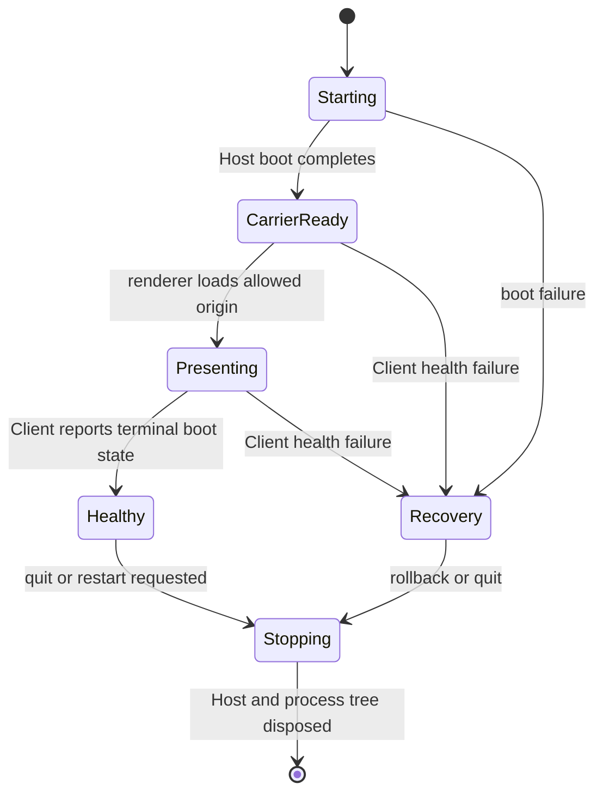

# 从 Evidence Map 到兼容原型

[English](0002-evidence-map-to-compatibility-tracer.en.md)

Lesson 0002，预计 25 分钟。

本课只训练一个能力：把 discovery 中找到的事实，转换成可自动验证的 compatibility tracer。Tracer 是贯穿 Host 启动、Carrier 就绪、Client 呈现和完整退出的最小端到端路径。

## 开始前：从记忆回答

先不要查看第一课，写出 Harness Desktop 接入的五层模型。然后回答：哪一层决定 UI 何时可以加载？

完成后再核对[第一课](0001-harness-to-desktop.md)。五层是 Host、Carrier、Client、Profile 和 Native。UI 能否加载不是 Client 单方面决定的；Carrier 必须先提供可验证的健康信号。

## 事实、未知项和决策必须分开

Discovery 最常见的错误，是把一次成功运行当成稳定 contract。

| 类型 | 示例 | 能否直接进入实现 |
| --- | --- | --- |
| 事实 | CLI help 声明 `--port 0`，测试确认返回实际端口 | 可以，保留证据位置 |
| 未知项 | 直接父进程退出后，孙进程是否仍存活 | 不可以，先设计实验 |
| 决策 | Desktop 只允许 `127.0.0.1` carrier | 可以，但必须说明理由和验证 |
| 假设 | stdout 出现 URL 就代表所有插件已加载 | 不可以，必须转成事实或未知项 |

Evidence map 的价值不是收集很多链接，而是阻止“看起来能跑”偷偷变成产品承诺。

## Compatibility tracer 的五段 contract

虽然最小路径常被概括为启动、健康、呈现和退出，可靠产品还需要第五段：恢复。

### 1. 启动 contract

回答四个问题：谁启动 Host、使用什么精确入口、传入哪些环境、谁拥有退出。DSH Desktop 在 Electron main 中建立运行环境，再启动官方 Host composition；桌面层没有复制 Agent runtime。

证据入口见 [`main.ts`](../../../dsh-plugin-desktop/src/main.ts) 中的 runtime bootstrap、profile preparation 和 `boot()` 调用。

### 2. 健康 contract

“端口已监听”只说明网络 socket 存在，不一定说明 Client 模块、插件和设置已经完成组合。健康信号必须对应用户真正需要的终态。

DSH Desktop 注册 Renderer boot report route，并由 Client 报告终态，见 [`index.ts`](../../../dsh-plugin-desktop/src/index.ts) 的 `RENDERER_BOOT_REPORT_PATH` 注册，以及 [`runtime.ts`](../../../dsh-plugin-desktop/src/runtime.ts) 的 `reportRendererBoot()` contract。

### 3. 呈现 contract

呈现 contract 定义允许加载的 origin、何时创建或显示窗口、导航边界和外部链接策略。DSH Desktop 要求 Web Server 绑定 `127.0.0.1`，再从实际端口构造同源 URL。

这里的 contract 是“loopback-only、明确 origin、sandboxed renderer”；`dsh-desktop-mode` 查询参数只是当前 DSH 实现细节。

### 4. 退出 contract

窗口关闭、应用退出、profile 切换和崩溃恢复可能走不同入口，但最终必须汇入一个退出协调器。它先 dispose Host 或完整 sidecar 进程树，再允许 native process 结束。

只等待直接子进程退出是不够的：包管理器、shell 和插件可能产生后代进程。

### 5. 恢复 contract

健康状态只能在完整 UI 成功挂载后提交。DSH Desktop 使用 `active`、`pending` 和 `lastKnownGood` 区分请求状态与已证实状态，见 [`profile-manager.ts`](../../../dsh-plugin-desktop/src/profile-manager.ts)。

这个设计可以迁移为通用规则：失败目标不能覆盖最后一次已证实可用的启动配置。

## Contract 与实现细节的边界

| 可迁移 contract | 当前 DSH 实现细节 |
| --- | --- |
| 使用上游权威 Host 入口 | Cordis `boot()` |
| Carrier 只绑定 loopback | `127.0.0.1` HTTP/WebSocket |
| Client 报告终态健康 | Renderer boot report route |
| Native 退出前释放运行时 | Cordis fiber disposal |
| 失败后恢复已证实配置 | `lastKnownGood` profile |
| 公共能力按 generation 生存 | `desktopProfiles`、`desktopPnpm` |

迁移到 Qianwen Harness 时，左列通常应该保留，右列必须重新发现。复制右列的类名和文件结构，反而会把适配器绑死在 DSH 上。

## 练习：为假想 Qianwen Harness 写 tracer

已知事实：

- `qwen web --port 0 --json-events` 启动本地服务。
- stdout 会输出 `server-listening`，包含实际端口。
- `/health` 在模型、插件和会话存储准备完成后返回 `ready`。
- 官方 React Client 从 `/` 提供。
- SIGTERM 会等待当前请求结束，但文档没有说明插件子进程。

请先自己填写：

| 阶段 | Contract | 仍需验证 |
| --- | --- | --- |
| 启动 |  |  |
| 健康 |  |  |
| 呈现 |  |  |
| 退出 |  |  |
| 恢复 |  |  |

### 参考判断

| 阶段 | Contract | 仍需验证 |
| --- | --- | --- |
| 启动 | Desktop 使用精确 argv 启动官方 CLI，解析结构化事件 | 环境变量、工作目录和重复实例行为 |
| 健康 | 收到端口后轮询 `/health`，只有 `ready` 才加载 Client | `ready` 是否包含全部 Client 插件 |
| 呈现 | 只加载实际 loopback origin，Renderer 保持 sandbox | 认证 cookie、重定向和外部链接行为 |
| 退出 | 发送 SIGTERM，等待整棵进程树退出并设置超时 | 插件子进程是否被官方 CLI 收回 |
| 恢复 | 仅在 Client 完成健康报告后提交配置 | 上游是否有 profile；没有就设计 Desktop 私有状态 |

## 本课完成标准

- 能区分事实、未知项、决策和假设。
- 能为一个目标写出启动、健康、呈现、退出和恢复五段 contract。
- 能指出哪些 DSH 机制是可迁移 contract，哪些是实现细节。
- 能为每个未知项给出一个可执行验证，而不是用推测填空。

下一次面对真实项目时，复制 [Integration Evidence Map](../reference/integration-evidence-map.md) 并填写。完成后把表格发给 Agent，让它检查证据缺口和错误的 contract 提升。

推荐主阅读：[DSH Desktop 架构](../../architecture.md)。任何 contract 边界不清楚，都可以继续向当前 Agent 提问。
